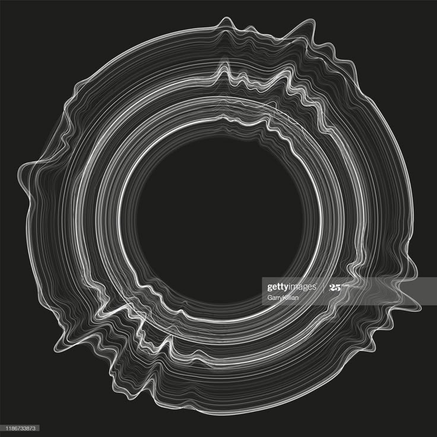
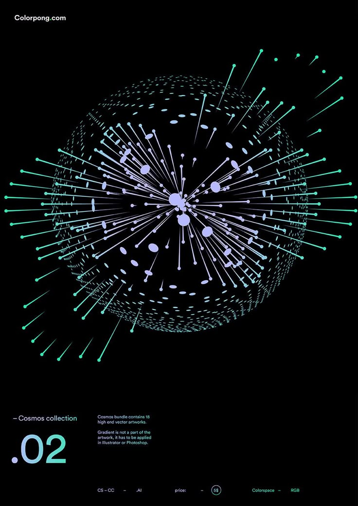

# Individual Code Description

## How to Interact

The overall dynamics of the work are similar to a "breathing" effect: when the mouse is still, the animation moves slowly; when the mouse moves quickly, the animation changes more violently. The specific interactive effects are as follows:

- **Animation Playback Control via Button:** There is a button below the canvas, which initially displays "PAUSE". After clicking, the screen turns black, the animation pauses, the button color turns red and displays "PLAY", and a line of text "Animation Paused" that rotates continuously will appear in the center of the screen. Click the button again to resume the animation.

- **Main Visual Dynamics (`mouseX`):** The faster the mouse moves, the more obvious the dynamic change of the main visual element, which enhances the visual tension.

- **Number of Circumscribed Triangles (`mouseY`):** When the mouse is close to the top of the canvas, the `mouseY` value is small and the number of triangles is small; when it is close to the bottom, the number increases.

- **Outer Circle Divergent Points (`mouseX`):** When `mouseX` is small, the points are concentrated in multiple circles; when the mouse moves horizontally, the dot matrix spreads and moves like a wave.

- **Diverging Line Angles (`mouseX`):** When the mouse moves horizontally, the angle of the lines will change randomly, increasing the dynamics and uncertainty of the picture.

- **Density of Central Random Points (`mouseX`):** When the value of `mouseX` changes, the random points in the central area will become denser or sparser.

## Details of My Individual Approach to Animating the Group Code

### Choice

I chose to use **Perlin noise and randomness** as the main drivers of my individual animation logic.

### Features of My Code

I developed the overall design around a **"breathing" sensation**. The main visual elements expand and contract slowly, mimicking a calm breathing rhythm. Meanwhile, I applied rhythmic motion to both the random points in the center and the divergent points on the outer circle, resulting in a visual that feels soft and organic.

Additionally, I introduced length variations to the background divergent lines, allowing them to change gradually within a specific range to enhance subtle visual dynamism. I also added a rotating circumscribed triangle at the center, and through a combination of consistent rotation and slight irregular jittering, the composition gains a richer sense of depth and motion.

To further enhance interactivity, I linked these animation parameters to `mouseX` and `mouseY`. The real-time mouse movement directly influences the degree of animation change, enabling the entire canvas to react smoothly and provide stronger visual feedback during interaction.

Finally, considering the group's original black-and-white color palette appeared a bit monotonous during motion, I introduced a healing color scheme to the animation. This makes the visual experience more gentle, soothing, and emotionally engaging.

## Inspiration

My work is mainly inspired by the following two visual references:

- **Figure 1:** The rhythmic lines in this image inspired me to build a wave-like line structure by combining multiple circles positioned at different coordinates. This structure conveys a sense of rhythm, as if the entire picture is "breathing". To recreate this feeling, I used the `noise()` function to control the positions of the small circles and applied a `for` loop to generate a layered, animated effect.

- **Figure 2:** This image presents a radial composition with a strong sense of space and direction. It features a dense arrangement of dot elements at the center and regularly spaced lines radiating outward. I drew from this visual form to structure the divergent lines in my work with more regularity. I also allowed the line lengths to change over time, and added movement to the decorative dots in the center to enhance visual richness.

These two references provided inspiration not only for rhythm and spatial composition but also helped clarify how to balance "order and randomness" in animation to produce visuals that feel both dynamic and harmonious.

  
**Figure 1:** Rhythmic Lines ([Source](https://www.pinterest.com/pin/1001839879614861818/))

  
**Figure 2:** Radial Composition ([Source](https://www.pinterest.com/pin/1001839879614863309/))

 ## Technical Explanation

### Animation Playback Control via Button

The principle of the button is to set its default style in the `setup()` function. A Boolean variable `isPaused` is used to manage the animation state. In the `ifPaused()` function, each button click toggles the value of `isPaused`, switching between the paused and playing states. Based on the current state, the button updates its style and label (e.g., changing color and text between `"PAUSE"` and `"PLAY"`). In the `draw()` function, this state determines whether the animation continues to play or a paused message is displayed, effectively enabling playback control through user interaction.

The style effect refers to [the p5js style](https://p5js.org/reference/p5.Element/style/).

```
function setup() {
	if (!button) {
		button = createButton("PAUSE");
		button.style('width', '100px');
		button.style('height', '40px');
		button.position((width - button.width) / 2, height * 0.9);
		button.style("font-size", "16px");
		button.style("padding", "6px 12px");
		button.style("background-color", "#666");
		button.style("color", "#fff");
		button.mousePressed(ifPaused);
	}

}

function draw(){
  	if (isPaused) {
		background(0)
		fill(255);
		textSize(32);
		textAlign(CENTER, CENTER);
		text("Animation Paused", 0, 0);

	}
}
function windowResized() {
	resizeCanvas(windowWidth, windowHeight);
	draw();
	button.position((width - button.width) / 2, height * 0.9);
}
function ifPaused() {
	isPaused = !isPaused;
	if (isPaused) {
		button.html("PLAY");
		button.style("background-color", "red");
	} else {
		button.html("PAUSE");
		button.style("background-color", "#666");
	}
}

```

### Main Visual Dynamics (`mouseX`)

The main visual element's size is dynamically controlled using the `noise()` and `map()` functions inside the `draw()` loop. A variable `timeFactor` increments on each frame to introduce time-based variation, while `mouseX` is used as a second input to `noise()` to make the animation responsive to horizontal mouse movement.

The value returned by `noise()` (ranging from `0` to `1`) is mapped to a fixed range between `200` and `400` using `map()`, which determines the diameter of the main element. This approach enables the element to smoothly grow and shrink over time and interaction, creating a natural, breathing-like motion.

```
let timeFactor = 0;

function draw() {
	timeFactor += 10;

	background(139, 15, 92);
	push();
	translate(width / 2, height / 2);

	// Keep the diameter of the subject element between 200 and 400
	let scale = map(noise(mouseX * 0.003, timeFactor * 0.005), 0, 1, 200, 400);
	let totalR = scale;

	// Draw all the concentric circles
	coreElements = new createMultipleCircle(0, 0, totalR);
}
```
### Number of Circumscribed Triangles (`mouseY`)

The circumscribed triangle is implemented by the `drawTriangle(d)` function inside a custom class, where the parameter `d` controls the rotation angle of each triangle. The number of triangles is dynamically determined by the `mouseY` value in the `draw()` function. Specifically, `mouseY` adjusts the number of iterations of the loop variable `i`, which in turn determines how many times `drawTriangle()` is called. This directly controls the number of circumscribed triangles rendered on the canvas.

```
function draw(){
  // Draw all the concentric circles
	coreElements = new createMultipleCircle(0, 0, totalR);
	push();
	rotate(frameCount);
	//The number of triangles is determined by mouseY
	for (let i = 0; i < mouseY / 100; i++) {
		coreElements.drawTriangle(i * 36);
	}
	pop();

}

class createMultipleCircle {
  constructor(centerX, centerY, centerSize) {
    this.x = centerX;
    this.y = centerY;
    this.size = centerSize;
  }
  // Draw different triangles
  drawTriangle(d) {
    let drawTriangleAlpha = map(noise(frameCount / 50), 0, 1, 20, 80);
    noFill();
    stroke(28, 53, 93, drawTriangleAlpha);
    strokeWeight(this.size / 80);
    let sr = (this.size * 1.15) * 2;

    let points = [];
    beginShape();
    for (let j = 0; j < 4; j++) {
      let sx1 = cos(120 * j - d) * (sr / 2) + this.x;
      let sy1 = sin(120 * j - d) * (sr / 2) + this.y;
      if (j < 3) {
        points.push(createVector(sx1, sy1));
      }
      vertex(sx1, sy1);
      circle(sx1, sy1, noise(frameCount / 50, j * 10) * j * 20);
      push();
    }
    pop();
    endShape();
  }
}
```
### Outer Circle Divergent Points (`mouseX`)

In the `createMultipleCircle` class, the `diverPoint()` method is used to draw a dot matrix structure that is arranged in a divergent manner around the center point. The position of each point is determined by the angle and the `noise()` function, allowing the dot matrix to form a regular and continuously changing dynamic pattern.

In the code, `mouseX` is used as one of the inputs to the `noise()` function, enabling horizontal mouse movement to control the degree of diffusion of the divergent points. The larger the `mouseX`, the stronger the noise fluctuation and the more dispersed the points become; conversely, the points appear more concentrated. This interaction changes the overall dynamic form of the visual pattern.

Additionally, the transparency and size of each point are calculated using the `map()` function, which further enhances the layering and visual expressiveness of the animation.

```
function draw() {
	coreElements = new createMultipleCircle(0, 0, totalR);
	coreElements.diverPoint();
}
class createMultipleCircle {
  constructor(centerX, centerY, centerSize) {
    this.x = centerX;
    this.y = centerY;
    this.size = centerSize;
  }

  // The ordered points of the outermost circle
  diverPoint() {
    for (let j = 0; j < 360; j += 0.2) {
      for (let i = 0; i < 3; i++) {
        let sizeFactor = map(i, 0, 2, 50, 35);
        let pointAlpha = map(i, 0, 2, 0, 30);
        push();
        noStroke();
        fill(34, 62, 90, pointAlpha);

        let diverPointBaseR = this.size / 2.2;
        let diverPointnoise = map(noise(j / 50, i / 10, frameCount / 12000), 0, 1, 0.9, 1.1);
        let diverpointR = diverPointBaseR * diverPointnoise;

        let posNoise = map(noise(i / 10, j / 10 * mouseX / 500, frameCount / 10), 0, 1, 0.95, 1.35);
        let x1 = cos(j * 3) * diverpointR / 1.3 * (4 - i / 10) * posNoise + this.x;
        let y1 = sin(j * 3) * diverpointR / 1.3 * (4 - i / 10) * posNoise + this.y;

        circle(x1, y1, diverpointR / sizeFactor * 2);
        pop();
      }
    }
  }
}
```
### Diverging Line Angles (`mouseX`)

This code uses the `drawLine()` method in the `createMutipleCircle` class to draw a group of lines radiating from the center. The angle, length, transparency, and thickness of each line are controlled by the `map()` function and the `noise()` function, creating a layered and dynamically changing radial line effect.

In the calculation of each line:

- `lengthFactor` controls the length of the line.  
- `drawLineAlpha` controls the transparency — the longer the line, the higher the transparency.  
- `drawLineThick` controls the thickness — the longer the line, the thicker it is.  
- `noiseX` and `noiseY` introduce subtle jitter through the `noise()` function, making the end points of the line (`drawLineX`, `drawLineY`) change dynamically.

In addition, by using the `mouseX` parameter in the `noise()` function to influence the overall angle, the work gains a stronger sense of interactivity.

```
function draw() {
	coreElements = new createMultipleCircle(0, 0, totalR);
	coreElements.drawLine();
}
class createMultipleCircle {
  constructor(centerX, centerY, centerSize) {
    this.x = centerX;
    this.y = centerY;
    this.size = centerSize;
  }
   drawLine() {
    let drawLineDegree = map(noise(mouseX / 10000), 0, 1, 60, 15);
    for (let j = 0; j < 10; j++) {
      for (let i = 0; i < 30; i++) {
        push();
        let lengthFactor = map(i, 0, 30, 0.3, 1.3);
        let drawLineAlpha = map(i, 0, 30, 20, 100);
        let drawLineThick = map(i, 0, 30, 0.5, 2.5);
        stroke(166, 36, 81, drawLineAlpha);
        strokeWeight(drawLineThick);

        let noiseX = noise(i / 150, (frameCount / 40 + j));
        let noiseY = noise(i / 150, (frameCount / 40 + j));
        let drawLineX = cos(drawLineDegree * j - 67.5 - i * 2) * this.size * noiseX * 4 * lengthFactor + this.x;
        let drawLineY = sin(drawLineDegree * j - 67.5 - i * 2) * this.size * noiseY * 4 * lengthFactor + this.y;

        line(this.x, this.y, drawLineX, drawLineY);
        pop();
      }
    }
  }
}
```
### Density of Central Random Points (`mouseX`)

The `randomPoint()` method in the `createMultipleCircle` class is used to generate a set of constantly changing scattered points around the center. The position, size, and transparency of each point are controlled by the `noise()` and `map()` functions, so that the dot matrix presents a dynamic motion effect while maintaining a certain regularity.

- `randomPointAlpha` controls the overall transparency of all points, and its value changes with time (`frameCount`).
- `randomPointR` is the radius of each point, controlled by `mouseX` and `noise()`, so the distribution of points changes with horizontal mouse movement.
- `randomPointAngle` is controlled by `noise()`, so that each point's position on the circle keeps shifting to create a flow effect.
- The position is calculated using `cos()` and `sin()`.
- The point size `randomPointSize` is also generated using `noise()` and `map()` to enhance layering and visual variation.

```
function draw() {
coreElements = new createMultipleCircle(0, 0, totalR);
	coreElements.randomPoint();
}

class createMultipleCircle {
  constructor(centerX, centerY, centerSize) {
    this.x = centerX;
    this.y = centerY;
    this.size = centerSize;
  }
    randomPoint() {
    push();
    let randomPointAlpha = map(noise(frameCount * 0.005), 0, 1, 20, 80);
    fill(178, 30, 80, randomPointAlpha);
    for (let j = 1; j < 35; j++) {
      for (let i = 0; i < 360; i += j / 4) {
        let dianR = map(j, 1, 100, this.size * 2.34 / 2, this.size / 2);
        let rNoise = noise(mouseX * 100 + j * 0.01, i / 50);
        let randomPointR = rNoise * this.size * 2.34 / 2 - dianR;

        let angleNoise = noise(frameCount / 1000 + j * 0.01, j / 100, i / 100);
        let randomPointAngle = angleNoise * i * 180 - j;

        let randomPointX = cos(randomPointAngle) * randomPointR + this.x;
        let randomPointY = sin(randomPointAngle) * randomPointR + this.y;

        noStroke();
        let randomPointSize = map(noise(i * 0.05, j * 0.05, frameCount * 0.05), 0, 1, this.size / 100, this.size / 40);
        circle(randomPointX, randomPointY, randomPointSize);
      }
    }
    pop();
  }
}
```

